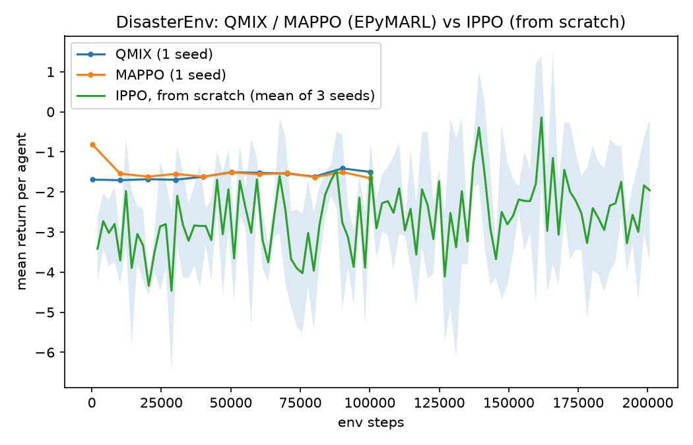

# Research elevation roadmap

This is the durable plan for moving this project from a browser simulation to
trained, benchmarked, published multi-agent RL research: real PyTorch
training, a standard PettingZoo environment, baselines with confidence
intervals, a coverage-and-safety novelty, and a short paper.

The roadmap, including the baby-step implementation guide with code and the
mathematical foundations for each component, lives in the author's private
planning notes. This file tracks what has actually landed in the repo.

## Status

| Phase | What it is | State |
|---|---|---|
| 0: repo hygiene | `.gitattributes`, HTML moved to `web/`, notebook to `notebooks/`, package skeleton | Done |
| 1: environment | `src/marl/envs/disaster_env.py`, a PettingZoo `ParallelEnv` | Done |
| 2: real training | `src/marl/algos/ippo.py` (Independent PPO, parameter sharing), `scripts/train_ippo.py` | Done: real gradient-based training, see below |
| 3: baselines + rigor | QMIX, MAPPO, IQL, VDN, MADDPG via EPyMARL; fairness ablation | QMIX and MAPPO trained for 100,000 steps each (1 seed), see below. IQL, VDN, MADDPG and the fairness ablation not yet run |
| 4: coverage novelty | Voronoi partitioning, boustrophedon CPP, K-means+2-opt routing, CBF-QP safety | Modules written (`src/marl/coverage/`), not yet integrated into training |
| 5: extra extension | Learned communication or GNN coordination, with an ablation | Not started |
| 6: sim-to-real validation | Gazebo or Isaac Sim demo of the trained policy | Not started |
| 7: generalization | Train on one map set, test on unseen; a second application domain | Not started |
| 8: paper | Short paper targeting a workshop, arXiv | Not started |

## First training result, honestly

`scripts/train_ippo.py` trains 3 seeds for 200,000 environment steps each on
the 4-agent, 8-survivor grid. The result (`results/learning_curve.png`) is a
real but noisy improvement: the mean return across seeds rises from around
-3 early in training to around -2 by the end, with a wide confidence band and
individual seeds that do not all improve monotonically (seed 0 goes from
-3.5 to -0.13, seed 1 from -4.25 to -1.77, seed 2 from -2.5 to -3.97). This is
the expected shape for a single shared network with no reward shaping beyond
the raw scout/rescue/time-penalty signal, not a tuned result. It is enough to
say training is real, not enough to claim the policy is good. Next steps for
a stronger curve: separate networks per role, reward shaping or curriculum,
and more seeds with variance reduction, before moving to QMIX/MAPPO via
EPyMARL.

## QMIX and MAPPO via EPyMARL, honestly

`src/marl/envs/disaster_pz_wrapper.py` registers `DisasterEnv` with EPyMARL's
`gymma` wrapper as `disaster-v0`. It is meant to be copied into a separate
`epymarl` checkout (a third-party repo, not committed here). QMIX and MAPPO
each trained for 100,000 environment steps, one seed:

```bash
git clone https://github.com/uoe-agents/epymarl.git
cp src/marl/envs/disaster_pz_wrapper.py epymarl/src/envs/
```

Then edit `epymarl/src/envs/__init__.py`: add
`from . import disaster_pz_wrapper  # noqa: F401` under the existing `gymma`
import, so the module's `gym.register(...)` call runs; and wrap the
`from .smaclite_wrapper import SMACliteWrapper` import in a
`try/except ImportError: SMACliteWrapper = None`, since SMACLite is an
optional dependency this project does not need and its absence otherwise
crashes the whole `envs` package on import. Then, from `epymarl/`:

```bash
pip install -r requirements.txt   # sacred, torch, pettingzoo, gymnasium, etc; see epymarl's own README
python src/main.py --config=qmix  --env-config=gymma with env_args.key="disaster-v0" env_args.time_limit=200 t_max=100000 seed=0
python src/main.py --config=mappo --env-config=gymma with env_args.key="disaster-v0" env_args.time_limit=200 t_max=100000 batch_size_run=1 batch_size=10 seed=0
```

Then, from this repo's root: `python -m scripts.plot_epymarl_baselines`,
which reads `epymarl/results/sacred/{qmix,mappo}/disaster-v0/1/metrics.json`
and writes `results/baseline_comparison.png`.

MAPPO's default runner collects `batch_size_run=10` episodes in parallel
subprocesses; that uses Python's spawn start method, which reliably re-imports
this project's own `sys.path` patch inside `disaster_pz_wrapper.py` in each
worker on Windows. Setting `batch_size_run=1` avoids that entirely at the
cost of running MAPPO's rollouts serially, so this MAPPO result is not using
its usual parallel-collection setup and is undertrained relative to that.

EPyMARL's `gymma` wrapper sums the reward across all agents into one team
return by default (`common_reward=True`), while `scripts/train_ippo.py`
reports the mean return per agent. `scripts/plot_epymarl_baselines.py`
divides the QMIX and MAPPO curves by the agent count so the comparison plot
below reads as mean return per agent for all three:



Final per-agent return: QMIX -1.50, MAPPO -1.655, IPPO -1.958 (mean of 3
seeds). QMIX and MAPPO's lines are the greedy evaluation return (deterministic
policy, no exploration) logged every 10,000 steps, so they are flatter by
construction; IPPO's line is the noisier training return. None of the three
are meaningfully solving the task yet (a time penalty alone gives about -2 per
agent per 200-step episode, so all three are close to doing barely better than
standing still), and this is 1 seed each for QMIX and MAPPO against 3 for
IPPO, so this is a first look, not a benchmark result. The fairness ablation
(training with the QMIX fairness term on vs off) has not been run.

## What is real here

`DisasterEnv` is deliberately small and fast, a 16x16 grid rather than the
full fBm terrain and fire cellular automaton in
`notebooks/drone_ugv_notebook.ipynb`. Deep RL training needs millions of
environment steps, so the fast grid is what gets trained on; porting the
richer terrain and fire model into this env, or building it as
`coverage_env.py`, is future work. The browser 3D simulation in `web/` is a
visualization layer, not the training environment, and is being kept as an
outreach demo, clearly separated from the research pipeline.

## Reproduce the current milestone

```bash
python -m venv .venv && .venv/Scripts/activate  # or source .venv/bin/activate
pip install -r requirements.txt
python -m scripts.sanity_random   # confirms the env runs
python -m scripts.train_ippo      # trains 3 seeds, ~10-20 min on CPU
python -m scripts.make_plots      # results/learning_curve.png
python -m scripts.render_rollout  # results/demo.gif, needs results/ippo.pt saved separately
```
